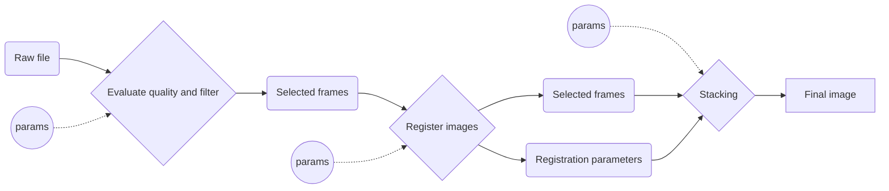

# OpenPlanetStacker Dev playground
Test playground for OpenPlanetStacker
- [Workflow](#workflow)
- [Requirements](#requirements)
  * [Input](#input)
  * [Frame selection](#frame-selection)
  * [Registration](#registration)
  * [Stacking](#stacking)
  * [Final Image](#final-image)
  * [Future Gui](#future-gui)
- [Challenges](#challenges)
  * [Registration](#registration-1)
  * [Stacking](#stacking-1)
- [Documentation](#documentation)
  * [Usefull tools](#usefull-tools)
  * [Doc](#doc)
  * [Knowhow](#knowhow)
    + [Registration](#registration-2)
  * [Similar projects](#similar-projects)
- [Ideas](#ideas)

# Workflow 
The stacking process follow this specific workflow

# Requirements
## Input
- [ ] Read .SER files
- [ ] Read .AVI files

## Frame selection
- [ ] Evaluate frames quality
- [ ] Select frames
  - [ ] As a fraction of the total number of frames
  - [ ] As a number of frames
  - [ ] Exlude frames by ID
- [ ] Select 1 reference frame

## Registration
- [ ] Linear transformation for each frame
  - [ ] Translation
  - [ ] Rotation
- [ ] Handle different type of features for the different types of images

 ## Stacking
 - [ ] Apply registration
 - [ ] ? Remove dark frame

## Final Image
- [ ] Export
- [ ] *future* Post processing: wavelet transform, deconvolution, ... and all funny stufs

## Future Gui
- [ ] Dark mode

# Challenges 
## Registration 
*Image type*
- [ ] One small planet in the picture [sample](https://www.astrobin.com/ynkp18/?q=saturn)
- [ ] Partial planet in the picture [sample](https://www.astrobin.com/s3zr4w/?q=moon)
- [ ] Only planet in the picture (moon or badass big telescops) [sample](https://www.astrobin.com/vofd5q/?q=moon)

*Frame quality*
- [ ] Define a reliable quality metric

## Stacking
- [ ] Define algorithm
- [ ] Include darks ? 

# Documentation 
## Usefull tools
- Linux SER player [repo](https://github.com/cgarry/ser-player)

## Doc
- SER files implementation [doc](doc/encoding/SER%20Doc%20V3b.pdf)
- AVI files implementation [doc](doc/encoding/avi.pdf)
## Knowhow
- Image stacking algorithms [cloudy nights forum](https://www.cloudynights.com/topic/285209-image-stacking-algorithms/)
- Siril registration [documentation](https://siril.readthedocs.io/en/latest/preprocessing/registration.html#registration-process)
- Astrophysics source code library [ASCL.net](http://www.ascl.net/code/all)

### Registration
- Automatic Extraction of Ellipsoidal Features for Planetary Image Registration [scihub](https://sci-hub.se/10.1109/lgrs.2011.2161263)
## Similar projects
- [lxnstack](https://github.com/mauritiusdadd/lxnstack) (8 years old, not maintened)

# Ideas
- Create a demo vesrion with only python and [streamlit](https://streamlit.io/)

# Special thanks 
Thanks to my girlfriend, who takes care of everything at home while I code when I'm supposed to be studying
